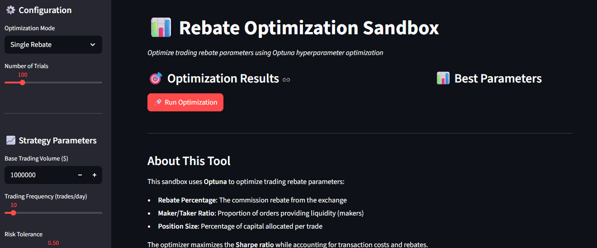
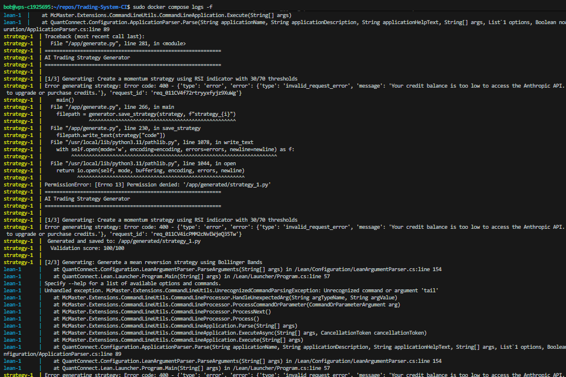

# Trading System CI - Monorepo

A comprehensive algorithmic trading system monorepo integrating QuantConnect Lean engine with AI-powered strategy generation and rebate optimization tools.

## 🏗️ Architecture

```
Trading-System-CI/
├── docker-compose.yml          # Orchestrates all services
├── lean-core/                  # QuantConnect Lean engine
│   ├── Dockerfile
│   └── Lean/                   # Lean engine submodule
├── services/
│   ├── rebate/                 # Rebate optimization sandbox
│   │   ├── Dockerfile
│   │   ├── app.py             # Streamlit UI with Optuna
│   │   └── requirements.txt
│   └── strategy/               # AI strategy generator
│       ├── Dockerfile
│       ├── generate.py        # AI code generation & validation
│       └── requirements.txt
└── data/                       # Shared data directory

```

## 🚀 Services

### 1. **lean-core** - QuantConnect Lean Engine
The algorithmic trading engine that executes strategies.

- **Technology**: C# / .NET, Python support
- **Purpose**: Backtesting and live trading execution
- **Base Image**: `quantconnect/lean:foundation`

### 2. **rebate** - Rebate Optimization Sandbox
Interactive UI for optimizing trading rebate parameters.

- **Technology**: Streamlit + Optuna
- **Port**: `8501`
- **Features**:
  - Hyperparameter optimization for rebate strategies
  - Visual analysis of optimization results
  - Parameter importance analysis
  - Export optimization data

### 3. **strategy** - AI Strategy Generator
Generates and validates trading strategies using AI.

- **Technology**: Python + Anthropic Claude API
- **Features**:
  - Natural language to trading strategy code
  - Support for Python and C# strategies
  - Automatic code validation
  - QuantConnect Lean compatibility checks

## 📦 Quick Start

### Prerequisites

- Docker & Docker Compose
- Git (with submodules initialized)
- (Optional) Anthropic API key for AI strategy generation

### 1. Clone Repository

```bash
git clone <your-repo-url>
cd Trading-System-CI

# Initialize Lean submodule if needed
git submodule update --init --recursive
```

### 2. Configure Environment

Create a `.env` file in the root:

```bash
# Optional: For AI strategy generation
ANTHROPIC_API_KEY=your_api_key_here

# Lean engine configuration
LEAN_DATA_DIRECTORY=/Data
```

### 3. Build and Run

```bash
# Build all services
docker-compose build

# Start all services
docker-compose up

# Or run specific service
docker-compose up rebate
```

### 4. Access Services

- **Rebate Optimization UI**: http://localhost:8501
- **Lean Engine**: Running in background (check logs: `docker-compose logs lean`)
- **Strategy Generator**: Run via `docker-compose run strategy`

### 5. Running Backtests (Using Utility Scripts)

The repository includes helpful utility scripts in the `scripts/` directory:

```bash
# Interactive menu to select and run algorithms
./scripts/backtest_menu.sh

# Or run a specific algorithm directly
./scripts/run_backtest.sh algorithms/SimpleBuyAndHold.py

# View backtest results
./scripts/view_results.sh

# Download sample market data
./scripts/download_sample_data.sh
```

These scripts handle Docker exec commands and result parsing automatically.

## 🔧 Development

### Running Individual Services

**Rebate Optimization:**
```bash
cd services/rebate
pip install -r requirements.txt
streamlit run app.py
```

**Strategy Generator:**
```bash
cd services/strategy
pip install -r requirements.txt
python generate.py
```

**Lean Engine:**
```bash
docker-compose up lean
```

### Generating Strategies

```bash
# Run the strategy generator
docker-compose run strategy

# Generated strategies saved to: services/strategy/generated/
```

### Customizing Optimization

Edit parameters in the Streamlit UI:
1. Go to http://localhost:8501
2. Adjust parameters in the sidebar
3. Click "Run Optimization"
4. Download results as CSV

## 📊 Usage Examples

### Example 1: Generate a Trading Strategy

```python
from generate import StrategyGenerator

generator = StrategyGenerator(api_key="your_key")

strategy = generator.generate_strategy(
    prompt="Create a momentum strategy using RSI with 30/70 thresholds",
    language="python"
)

validation = generator.validate_strategy(strategy["code"], "python")
if validation["valid"]:
    filepath = generator.save_strategy(strategy, "my_rsi_strategy")
    print(f"Strategy saved to: {filepath}")
```

### Example 2: Optimize Rebate Parameters

1. Open http://localhost:8501
2. Set your base trading volume and frequency
3. Click "Run Optimization"
4. Review best parameters and estimated savings
5. Download trial data for further analysis

## 🛠️ Configuration

### Docker Compose Services

**lean:**
- Build context: `./lean-core`
- Volumes: `./data:/Data`, `./lean-core:/Lean`
- Interactive terminal enabled

**rebate:**
- Build context: `./services/rebate`
- Port: `8501:8501`
- Volume mount for live code updates

**strategy:**
- Build context: `./services/strategy`
- Depends on: `lean`
- Volume mount for data sharing

## 🧪 Testing

```bash
# Test strategy generation
docker-compose run strategy python -m pytest

# Test rebate service (run in container)
docker-compose run rebate python -m pytest

# View lean logs
docker-compose logs -f lean
```

## 🖼️ Screenshots

### Rebate Optimization Sandbox


The interactive Streamlit interface allows you to optimize trading rebate parameters using Optuna hyperparameter optimization.

## ⚠️ Known Issues & Troubleshooting



### Common Issues

#### 1. **Anthropic API Credit Error (400)**
```
Error code: 400 - {'type': 'error', 'error': {'type': 'invalid_request_error',
'message': 'Your credit balance is too low to access the Anthropic API.'}}
```
**Solution**:
- Add credits to your Anthropic account at https://console.anthropic.com/
- Or set up a valid API key with available credits in your `.env` file
- The strategy generator service requires API credits to function

#### 2. **Permission Denied Error on Strategy Generation**
```
PermissionError: [Errno 13] Permission denied: '/app/generated/strategy_1.py'
```
**Solution**:
- This was fixed in the latest Docker configuration
- The `services/strategy/Dockerfile` now creates the `generated/` directory with proper permissions
- Rebuild the container: `docker-compose build strategy`

#### 3. **Lean Engine Configuration Errors**
```
UnhandledExceptionEventArgs: Unrecognized command or argument 'tail'
at QuantConnect.Configuration.ApplicationParser.ParseArguments
```
**Solution**:
- These errors occur when the Lean container uses `tail -f /dev/null` as a keep-alive command
- This is intentional - the Lean engine is now designed to stay running so you can exec backtests into it
- To run a backtest, use: `docker-compose exec lean dotnet /Lean/Launcher/bin/Release/QuantConnect.Lean.Launcher.dll`
- Or use the provided utility scripts in `scripts/` directory

#### 4. **Missing Lean DLL or Build Issues**
**Solution**:
- Ensure the Lean submodule is initialized: `git submodule update --init --recursive`
- Rebuild the lean-core container: `docker-compose build lean --no-cache`
- The Dockerfile now includes proper build steps with `dotnet restore` and `dotnet build`

#### 5. **Volume Mount Issues**
**Solution**:
- The docker-compose.yml now uses selective volume mounts
- If you need to develop Lean algorithms, uncomment the development volume mounts in docker-compose.yml
- For production use, keep the default configuration to preserve built DLLs

### Getting Help
If you encounter other issues:
1. Check the logs: `docker-compose logs -f [service-name]`
2. Rebuild containers: `docker-compose build --no-cache`
3. Check that all environment variables are set in `.env`
4. Verify the Lean submodule is properly initialized

## 📝 Project Status

### Completed
- ✅ Monorepo structure with docker-compose orchestration
- ✅ Lean engine Docker integration
- ✅ AI-powered strategy generator with validation
- ✅ Interactive rebate optimization UI with Optuna
- ✅ CI/CD pipeline setup (GitHub Actions)

### In Progress
- 🔄 Strategy backtesting automation
- 🔄 Integration between strategy generator and Lean engine
- 🔄 Advanced validation and risk metrics

### Planned
- 📋 Live trading integration
- 📋 Real-time performance monitoring dashboard
- 📋 Multi-exchange rebate comparison
- 📋 Automated strategy deployment

## 🤝 Contributing

1. Fork the repository
2. Create a feature branch: `git checkout -b feature/my-feature`
3. Commit changes: `git commit -am 'Add my feature'`
4. Push to branch: `git push origin feature/my-feature`
5. Submit a pull request

## 📄 License

[Add your license here]

## 🔗 Resources

- [QuantConnect Documentation](https://www.quantconnect.com/docs)
- [QuantConnect Lean GitHub](https://github.com/QuantConnect/Lean)
- [Optuna Documentation](https://optuna.readthedocs.io/)
- [Streamlit Documentation](https://docs.streamlit.io/)

## 📧 Support

For issues and questions:
- Open an issue on GitHub
- Check existing documentation
- Review QuantConnect forums

---

**Built with**: QuantConnect Lean, Python, Docker, Streamlit, Optuna, and Claude AI
